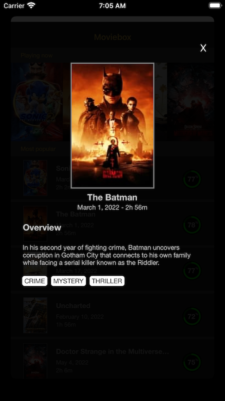

# MVVM-C & RxSwift by Bartosz Żarczyński

| | |
| --- | --- |
|  |  |

## Architecture

Solution implemented using MVVM-C, which is my preferred pattern. 

* Model - dummy models reflecting json content donwloaded from API
* View - pure views without any logic
* ViewModel - responsible for getting data via service, contains presentation logic and exposes ready data to views
* Coordinator - extra layer for managing navigation

Coordinator layer might seem to be an overhead for application containing only two screens, but i wanted to emphasize that it is a good practice to move out the navigation logic from view controllers or view models. 

### Reactive framework

I used RxSwift and related libraries to implement binding between view models and views. 
I am an Rx-enthusiast. In my opinion reactive paradigm is very natural. We can define streams representing constant logic. Logic doesn't changes, only data does. 

### UI

I implemented all views in code. The only reason is that i used to do so in current and previous workplace and it's just my habit. 

## Third-Party libraries

I used CocoaPods as a dependency manager. 

* Alamofire & RxAlamofire - very popular networking library, has ready machnism for caching
* RxFlow - provides coordinatation mechanism for Rx apps
* ObjectMapper - convinient json mapping
* Swinject - DI container
* PureLayout - convinient interface for setting AutoLayout constraints in code
* Mocker - allows to replace the response with hardcoded json for UrlSession network calls, used for testing
* PullToRefreshKit - ready pull-down-to-refresh mechanism 

## Tests

I provided unit tests for view models' logic. 
I registered two instances of MovieService: one making real network calls, second able to return mocked data. 

## Comments

Caching mechanism tested by using CharlesProxy. When running the app, CharlesProxy displays all network calls. After loading few more pages, refreshing the list and loading more pages again, no new network calls appeared on the list, but the content appeared in the app, thus the content was taken from the cache. 
